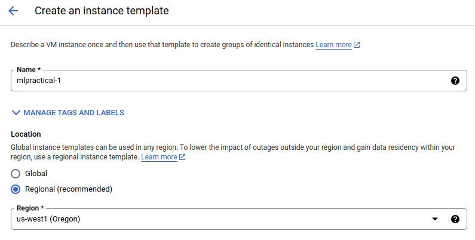
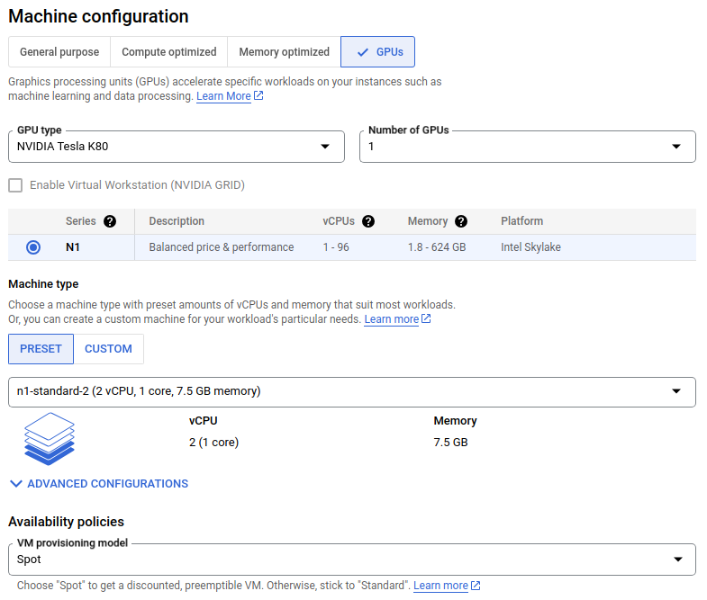
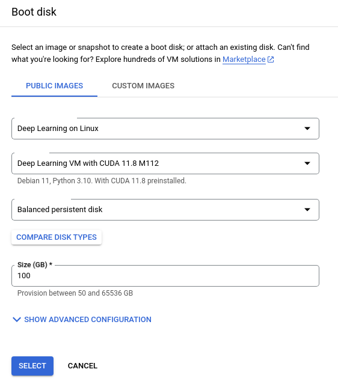
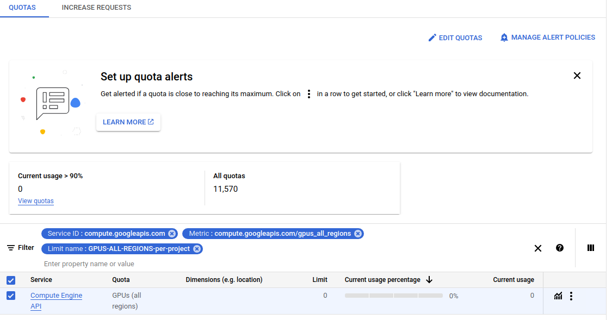

# Google Cloud Usage Tutorial

This document has been created to help you setup a google cloud instance to be used for the MLP course using the student credit the course has acquired.
This document is non-exhaustive and many more useful information is available on the [google cloud documentation page](https://cloud.google.com/docs/).
For any question you might have, that is not covered here, a quick google search should get you what you need. Anything in the official google cloud docs should be very helpful.

| WARNING: Read those instructions carefully. You will be given 50$ worth of credits and you will need to manage them properly. We will not be able to provide more credits. |
| -------------------------------------------------------------------------------------------------------------------------------------------------------------------------- |


### To create your account and start a project funded by the student credit

1. Login with your preferred gmail id to [google cloud console](https://cloud.google.com/). Click on `Console` (upper right corner), which would lead you to a new page and once there, click on Select a Project on the left hand side of the search bar on top of the page and then click on New Project on the right hand side of the Pop-Up.
Name your project sxxxxxxx-MLPractical - replacing the sxxxxxxx with your student number. **Make sure you are on this project before following the next steps**. 
2. Get your coupon by following the instructions in the coupon retrieval link that you received.
3. Once you receive your coupon, follow the email instructions to add your coupon to your account.
4. Once you have added your coupon, join the [MLPractical GCP Google Group](https://groups.google.com/forum/#!forum/mlpractical_gcp) using the same Google account you used to redeem your coupon. This ensures access to the shared disk images.
5. Make sure that the financial source for your project is the MLPractical credit. You can check this by going to the [Google Cloud Console](https://console.cloud.google.com/) and selecting your project. Then, click on the `Billing` tile. Once on the `Billing` page, select `Account management` from the left hand side menu. You should see your project under `Projects linked to this billing account`. If not, you can add it by clicking on `Add projects` and selecting your project from the list of available projects. 
6. Start the project

### To create an instance

1. On the console page, click the button with the three lines at the top left corner.
2. In the ```Compute Engine``` sub-menu select ```VM Instances```.
3. Enable ```Compute Engine API``` if prompted.
4. Click the ```CREATE INSTANCE``` button at the top of the window. 
5. Click on ```VM FROM INSTANCE TEMPLATE```, and create your VM template for this coursework:
6. Name the template ```mlpractical-1```.
7. Select ```Regional``` as the location type and ```us-west1(Oregon)``` as the region.



8. Under ```Machine Configuration```, select ```GPU``` machine family. Select one NVIDIA Tesla K80. Those are the cheapest one, be careful as others can cost up to 8 times more to run.
9. Below, in ```Machine type```, under ```PRESET``` select ```n1-standard-2 (2 vCPU, 1 core, 7.5Gb memory)```.



10. Under ```Boot disk```, click change.
11. On the right-hand new menu that appears (under ```PUBLIC IMAGES```), select
    * ```Deep Learning on Linux``` operating system,
    * ```Depp Learning VM for PyTorch 2.0 with CUDA 11.8 M112``` version,
    * ```Balanced persistent disk``` as boot disk type, 
    * ```100```GB as disk size, and then click select at the bottom.


    
12. Under ```Availability policies```, in the ```VM provisioning model``` drop down menu, select ```Spot```. Using this option will be helpful if you're running low on credits.
13. You can ```Enable display device``` if you want to use a GUI. This is not necessary for the coursework.
14. Leave other options as default and click ```CREATE```.
15. Tick your newly created template and click ```CREATE VM``` (top centre).
16. Click ```CREATE```. Your instance should be ready in a minute or two.
15. If your instance failed to create due to the following error - ```The GPUS-ALL-REGIONS-per-project quota maximum has been exceeded. Current limit: 0.0. Metric: compute.googleapis.com/gpus_all_regions.```, click on ```REQUEST QUOTA``` in the notification.
16. Tick ```Compute Engine API``` and then click ```EDIT QUOTAS``` (top right).



17. This will open a box in the right side corner. Put your ```New Limit``` as ```1``` and in the description you can mention you need GPU for machine learning coursework.
18. Click ```NEXT```, fill in your details and then click ```SUBMIT REQUEST```.
19. You will receive a confirmation email with your Quota Limit increased. This may take some minutes.
20. After the confirmation email, you can recheck the GPU(All Regions) Quota Limit being set to 1. This usually shows up in 10-15 minutes after the confirmation email. 
21. Retry making the VM instance again as before, by choosing your template, and you should have your instance now. 


#### Note
Be careful to select 1 x K80 GPU (P100s and P4s are 5x more expensive).

You only have $50 dollars worth of credit, which should be about 125 hours of GPU usage on a K80.


### To login into your instance via terminal:

1. In a DICE terminal window ```conda activate mlp```
2. Download the `gcloud` toolkit using ```curl -O https://dl.google.com/dl/cloudsdk/channels/rapid/downloads/google-cloud-sdk-365.0.0-linux-x86_64.tar.gz```
3. Install the `gcloud` toolkit using ```tar zxvf google-cloud-sdk-365.0.0-linux-x86_64.tar.gz; bash google-cloud-sdk/install.sh```.
**Note**: You might be asked to provide a passphrase to generate your local key, simply use a password of your choice. There might be some Yes/No style questions as well, choose yes, when that happens.

4. Reset your terminal using ```reset; source ~/.bashrc```. Then authorize the current machine to access your nodes run ```gcloud auth login```. This will authenticate your google account login.
3. Follow the prompts to get a token for your current machine.
4. Run ```gcloud config set project PROJECT_ID``` where you replace `PROJECT-ID` with your project ID. You can find that in the projects drop down menu on the top of the Google Compute Engine window; this sets the current project as the active one. If you followed the above 
instructions, your project ID should be `sxxxxxxx-mlpractical`, where `sxxxxxxx` is your student number.
5. In your compute engine window, in the line for the instance  that you have started (`mlpractical-1`), click on the downward arrow next to ```SSH```. Choose ```View gcloud command```. Copy the command to your terminal and press enter. Make sure your VM is up and running before doing this.
6. Add a password for your ssh-key (and remember it!). 
7. Re-enter password (which will unlock your ssh-key) when prompted.
8. On your first login, you will be asked if you want to install nvidia drivers, **DO NOT AGREE** and follow the nvidia drivers installation below.
9. Install the R470 Nvidia driver by running the following commands:
    * Add "contrib" and "non-free" components to /etc/apt/sources.list
    ```
    sudo -e /etc/apt/sources.list
    ```
    * Add the following lines:
    ```
    deb http://deb.debian.org/debian/ bullseye main contrib non-free
    deb-src http://deb.debian.org/debian/ bullseye main contrib non-free
    ```
    * Check that the lines were well added by running again:
    ```
    sudo -e /etc/apt/sources.list
    ```
    * Update the list of available packages and install the nvidia-driver package:
    ```
    sudo apt update
    sudo apt install nvidia-driver firmware-misc-nonfree
    ```
10. Run ```nvidia-smi``` to confirm that the GPU can be found.  This should report 1 Tesla K80 GPU. if not, the driver might have failed to install.
11. Well done, you are now in your instance and ready to use it for your coursework.
12. Clone a fresh mlpractical repository, and checkout branch `coursework2`: 

```
git clone https://github.com/VICO-UoE/mlpractical.git ~/mlpractical
cd ~/mlpractical
git checkout -b coursework2 origin/mlp2023-24/coursework2
python setup.py develop
```

Then, to test PyTorch running on the GPU, run this script that trains a small convolutional network (7 conv layers + 1 linear layer, 32 filters) on CIFAR100:

```
python pytorch_mlp_framework/train_evaluate_image_classification_system.py --batch_size 100 --seed 0 --num_filters 32 --num_stages 3 --num_blocks_per_stage 0 --experiment_name VGG_08_experiment --use_gpu True --num_classes 100 --block_type 'conv_block' --continue_from_epoch -1
```

You should be able to see an experiment running, using the GPU. It should be doing about 26-30 it/s (iterations per second). You can stop it when ever you like using `ctrl-c`.

If all the above matches what’s stated then you should be ready to run your coursework jobs.

To log out of your instance, simply type ```exit``` in the terminal.

### Remember to ```stop``` your instance when not using it. You pay for the time you use the machine, not for the computational cycles used.
To stop the instance go to `Compute Engine -> VM instances` on the Google Cloud Platform, slect the instance and click ```Stop```.

#### Future ssh access:
To access the instance in the future simply run the `gcloud` command you copied from the google compute engine instance page.


## Copying data to and from an instance

Please look at the [google docs page on copying data](https://cloud.google.com/filestore/docs/copying-data).

To copy from local machine to a google instance, have a look at this [stackoverflow post](https://stackoverflow.com/questions/27857532/rsync-to-google-compute-engine-instance-from-jenkins).

## Running experiments over ssh:

If ssh fails while running an experiment, then the experiment is normally killed.
To avoid this use the command ```screen```. It creates a process of the current session that keeps running whether a user is signed in or not.
 
The basics of using screen is to use ```screen``` to create a new session, then to enter an existing session you use:
```screen -ls```
To get a list of all available sessions. Then once you find the one you want use:
```screen -d -r screen_id``` 
Replacing screen_id with the id of the session you want to enter.

While in a session, you can use:
- ```ctrl+a+esc``` To pause process and be able to scroll.
- ```ctrl+a+d``` to detach from session while leaving it running (once you detach you can reattach using ```screen -r```).
- ```ctrl+a+n``` to see the next session.
- ```ctrl+a+c``` to create a new session.
 
