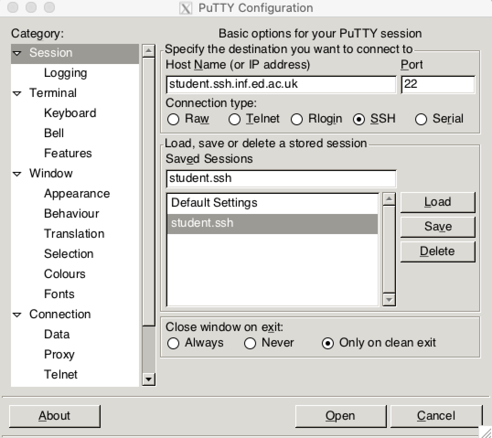
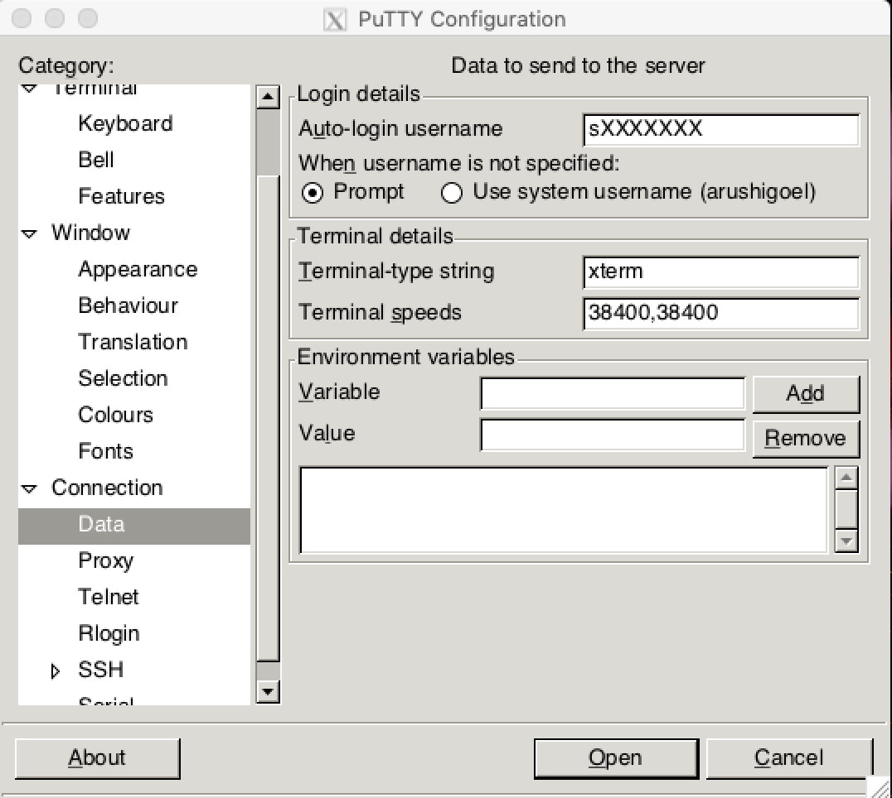
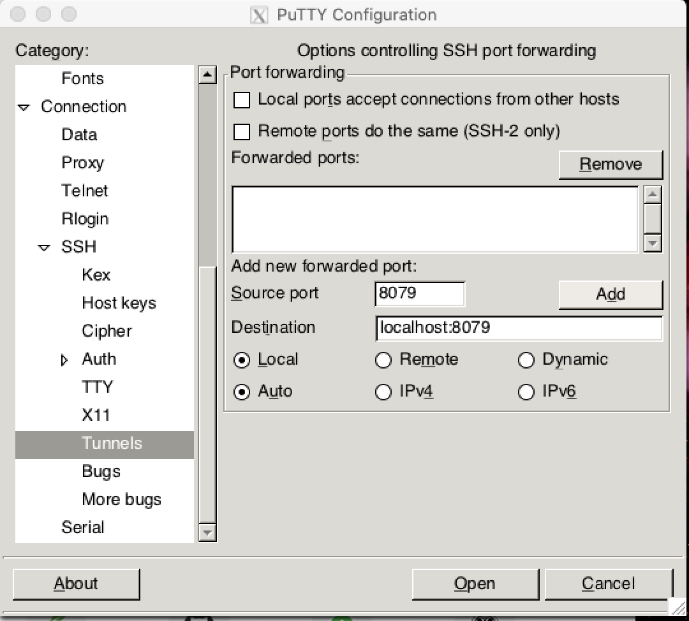
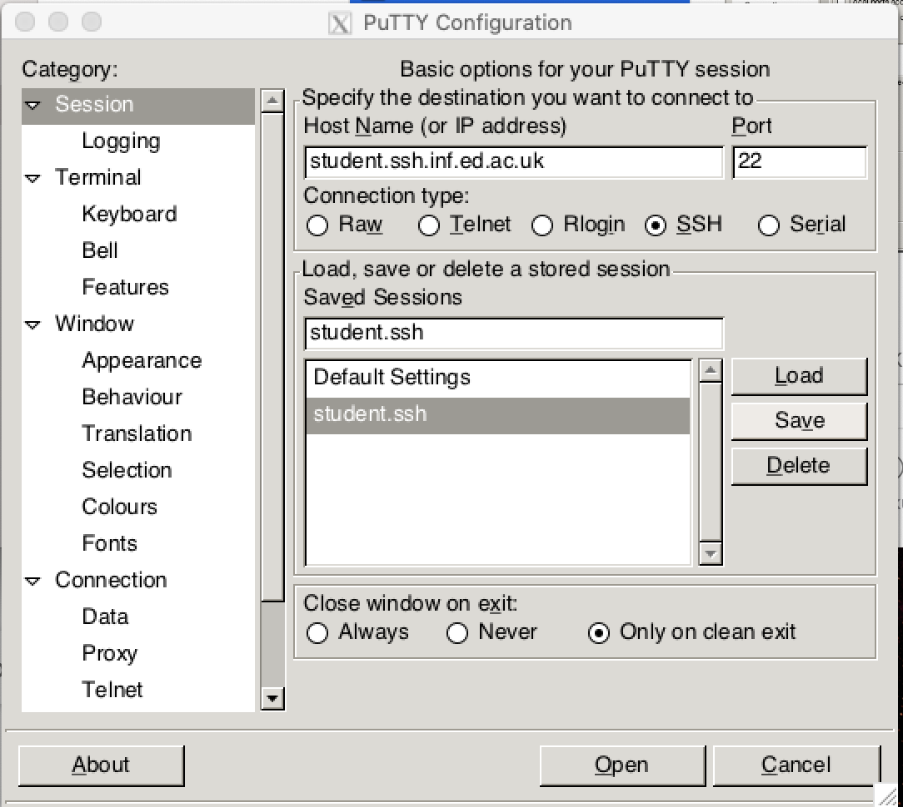

# Remote Working Guide 

This page helps you to use School computers from home. 

School supports multiple ways for accessing School computers including using [remote desktop service](http://computing.help.inf.ed.ac.uk/remote-desktop), [Virtual Dice Machine](http://computing.help.inf.ed.ac.uk/vdice) and External Login via ssh. 

External Login provides a fast way to connect remotely to the DICE system is through firewall via ssh. We recommend this option and explain how to use it next. If you like to use the other options, please follow the links above.

The first step is to access the Informatics student server, simply start a terminal application in your computer and enter the following:

```
ssh [dice-username]@student.ssh.inf.ed.ac.uk
```
It is assumed you already have a SSH client set up on the machine you are connecting from and that you are familiar with how to use SSH. If this is not the case, please read "How to use an SSH gateway" in the [information page](http://computing.help.inf.ed.ac.uk/external-login).

Now you can set up the environment as given in these [instructions](environment-set-up.md). 
Once you have done that, you may want to run jupyter notebooks over SSH which you can do so by following the step-by-step detailed instructions below.  

**Note**: If you are using Windows OS, then skip to the instructions [here](remote-working-guide.md#set-up-ssh-tunneling-in-windows) to connect to the remote server. 

# Running Jupyter notebooks over SSH

Below is a guide for how to start a Jupyter notebook server remotely on one of the shared-use `student.compute` servers and to connect to it on a local machine by port-forwarding over SSH. These instructions have been written for use with a SSH client running within a terminal session - although it may be possible to replicate the relevant commands within a GUI based SSH client, you will need to figure out how to do this yourself. They were written and tested on Ubuntu 14.04 and no attempt has been made to test them on other operating systems.

## Securing your notebook server

Before running a Jupyter notebook server instance on one of the shared compute servers you **must** make sure you have secured your server by configuring it to use a password and to communicate that password between the browser client and server by secure HTTP. This can be done on by running the `secure-notebook-server.sh` bash script provided in the `scripts` directory of the `mlpractical` repository. You can either do this when logged on to DICE in one of the labs or after connecting to DICE remotely over SSH as described below.

To run the script, in a DICE terminal enter the `mlpractical` repository directory and run
```
bash scripts/secure-notebook-server.sh
```
As this script creates a self-signed certificate to set up the secure HTTP encrypted communication between the browser and server, you will be shown a security warning when you load up the URL the notebooks are being served on.

If you want to manually secure the notebook server yourself or to create a certificate which will stop the security warnings appearing you can refer to the [relevant official Jupyter documentation page](https://jupyter-notebook.readthedocs.io/en/latest/notebook.html).

## Connecting to a remote `student.compute` server over SSH

To start an SSH session, open a terminal window and run

```
ssh [dice-username]@student.ssh.inf.ed.ac.uk
```

If this is this is the first time you have logged on to the SSH gateway server from this computer you will be asked to confirm you wish to connect and a ECDSA key fingerprint printed. You can check this against the reference values on the [school help pages](http://computing.help.inf.ed.ac.uk/external-login).

You will then be asked to enter your password. This is the same password you usually use to log on to DICE.

Assuming you enter the correct password, you will at this point be logged in to the SSH *gateway server*. As the message printed when you log in points out this is intended only for accessing the Informatics network externally and you should **not** attempt to work on this server. You should log in to one of the `student.compute` shared-use servers by running

```
ssh student.compute
```

You should now be logged on to one of the shared-use compute servers. The name of the server you are logged on to will appear at the bash prompt e.g.

```
ashbury:~$
```

You will need to know the name of the remote server you are using later on.

## Starting a notebook server on the remote computer

You should now activate your `mlp` Conda environment by running

```
source activate mlp
```

Now move in to the `mlpractical` local repository directory e.g. by running

```
cd ~/mlpractical
```

if you chose the default of putting the repository in your home directory.

We will now launch a notebook server on the remote compute-server. There are two key differences in the command we use to do this compared to how we usually start up a server on a local machine. First as the server will be running remotely you should set the `--no-browser` option as this will prevent the remote server attempting open a browser to connect to the notebook server.

Secondly we will prefix the command with `nice`. `nice` is a shell command which alters the scheduling priority of the process it is used to start. Its important to use `nice` when running on the shared `student.compute` servers to make sure they remain usable by all of the students who need to run jobs on them. You can set a priority level between 10 (highest priority) and 19 (lowest priority) using the `-n` argument. Running the command below will start up a notebook server at the lowest priority level.

```
nice -n 19 jupyter notebook --no-browser
```

Once the notebook server starts running you should take note of the port it is being served on as indicated in the `The Jupyter Notebook is running at: https://localhost:[port]/` message.

## Forwarding a connection to the notebook server over SSH

Now that the notebook server is running on the remote server you need to connect to it on your local machine. We will do this by forwarding the port the notebook server is being run on over SSH to you local machine. As all external connections from outside the `inf.ed.ac.uk` domain have to go via the SSH gateway server we need to go via this gateway server.

In a **new terminal window / tab** run the command below with the `[...]` placeholders substituted with the appropriate values to securely forward the specified port on the remote server to your local machine and bind it to a local port. You should choose `[remote-port]` to be the port the notebook server is running on on the remote server, `[local-port]` to be a currently unused port on your local machine and `[remote-server-name]` to be the host name of the remote server the notebook server is being run on.

```
ssh -N -o ProxyCommand="ssh -q [dice-username]@student.ssh.inf.ed.ac.uk nc [remote-server-name] 22" \
  -L [local-port]:localhost:[remote-port] [dice-username]@[remote-server-name]
```

You will be asked to enter your (DICE) password twice, once to log on to the gateway server and a second time to log on to the remote compute server.

Assuming you enter your password both times correctly, the remote port will now be getting forwarded to the specified local port on your computer. If you now open up a browser on your computer and go to `https://localhost:[local-port]` you should (potentially after seeing a security warning about the self-signed certificate) now asked to enter the notebook server password you specified earlier. Once you enter this password you should be able to access the notebook dashboard and open and edit notebooks as you usually do in laboratories.

When you are finished working you should both close down the notebook server by entering `Ctrl+C` twice in the terminal window the SSH session you used to start up the notebook server is running and halt the port forwarding command by entering `Ctrl+C` in the terminal it is running in.


## Set-Up SSH Tunneling in Windows 

School machines can also be logged in if you are using Windows on your personal computer. The school recommends installing [PuTTY](http://computing.help.inf.ed.ac.uk/installing-putty) for remotely logging in. 

Please first follow the instructions given on the computing webpage for installing PuTTY and Kerberos.   

Here we provide a detailed guide for setting-up PuTTY with tunnel forwarding so that it is convenient to use the jupyter notebooks on your personal machine. 

1. To start off, run the PuTTY executable file you downloaded, navigate to **Session** on the left column and enter the **hostname** as `student.ssh.inf.ed.ac.uk`. Put any name in the **Saved Sessions** box so that you can retrieve your saved PuTTY session for future use.  

Change the remaining options as is in the screenshot below. 

<center></center> 

2. Now navigate to **Connection** and drop-down on **Data**. In **Auto-Login username** , enter your student id `sXXXXXXX`. 
    
<center></center> 

3. After step 1 and 2, follow the instructions [here](http://computing.help.inf.ed.ac.uk/installing-putty) from screenshots 3-5 to set-up **Auth** and **X11 Forwarding**. To avoid errors later, strictly follow the instructions for this set-up. 

4. In this step, we will configure SSH tunneling to locally run the notebooks. On the left side of the PuTTY window, navigate to **Tunnels** under SSH and then add a `[local-port]` in **Source port** and `localhost:[local-port]` in **Destination**.  Remember the `[local-port]`  you used here as we will need this later. 
        

<center></center> 
        
Then press **Add** near the Source port box to add your new forwarded port. Once you add, you will see your newly added port as shown below - 
    
<center></center> 
        
5. After you have done steps 1-4, navigate back to **Session** on the left side and click **Save** to save all your current configurations. 

    <center></center> 
        
6.  Then click **Open** and a terminal window will pop-up asking for your DICE password. After you enter the password, you will be logged in to SSH Gateway Server.  As the message printed when you log in points out this is intended only for accessing the Informatics network externally and you should not attempt to work on this server. You should log in to one of the student.compute shared-use servers by running - 

```
ssh student.compute
```
You should now be logged on to one of the shared-use compute servers. The name of the server you are logged on to will appear at the bash prompt e.g.

```
ashbury:~$
```
You will need to know the name of this remote server you are using later on.


7.  You can setup your `mlp` environment by following the instructions [here](environment-set-up.md). If you have correctly set-up the environment, activate your `conda` environment and navigate to the jupyter notebooks as detailed [here](remote-working-guide.md#starting-a-notebook-server-on-the-remote-computer).  You should also secure your notebook server by following the instructions [here](remote-working-guide.md#running-jupyter-notebooks-over-ssh). 

Once the notebook server starts running you should take note of the port it is being served on as indicated in the `The Jupyter Notebook is running at: https://localhost:[port]/` message.

8.  Now that the notebook server is running on the remote server you need to connect to it on your local machine. We will do this by forwarding the port the notebook server is being run on over SSH to your local machine. 

       For doing this, open another session of PuTTY and load the session that you saved in the **Session** on the left side. Enter the password in the prompt and this will login to the SSH gateway server. **Do not** run `ssh student.compute` now. 
       
       In this terminal window, enter the command below - 
       
       ```
       ssh -N -f -L localhost:[local-port]:localhost:[port] [dice-username]@[remote-server-name] 
       ```
       The `[local-port]` is the source port you entered in Step 4, `[port]` is the remote port running on the remote server as in Step 7 and  `[remote-server-name]` is the name of the remote server you got connected to in Step 6. 
       
       If asked for a password at this stage, enter your DICE password again to login. 
       
   9.  Assuming you have set-up correctly, the remote port will now be getting forwarded to the specified local port on your computer. If you now open up a browser on your computer and go to `https://localhost:[local-port]`  you should (potentially after seeing a security warning about the self-signed certificate) now asked to enter the notebook server password you specified earlier. Once you enter this password you should be able to access the notebook dashboard and open and edit notebooks as you usually do in laboratories.
   
   When you are finished working you should both close down the notebook server by entering `Ctrl+C` twice in the terminal window the SSH session you used to start up the notebook server is running and halt the port forwarding command by entering `Ctrl+C` in the terminal it is running in.
   
   